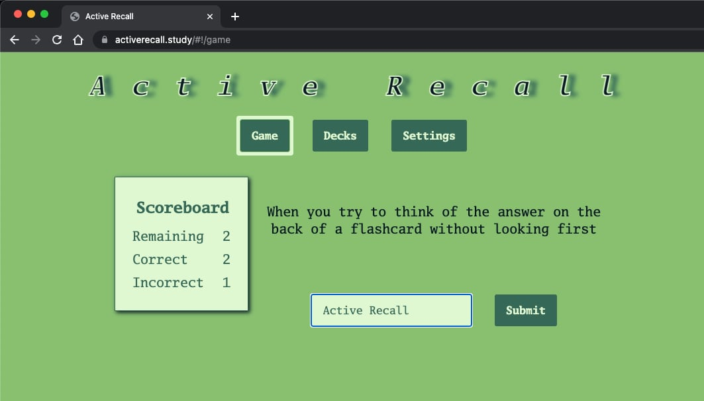

# Active Recall JS
Like [Anki](https://en.wikipedia.org/wiki/Anki_(software)) but more interactive and using text to speech for easy eyes closed studying.

It's fun to play with the voice options on the Settings page.

Hosted at [activerecall.study](https://activerecall.study)

Voices implemented with the [Web Speech API](https://developer.mozilla.org/en-US/docs/Web/API/Web_Speech_API).

Made with [MithrilJS](https://mithril.js.org/index.html).

